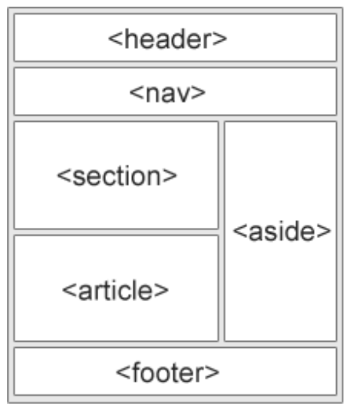

# Semantic elements

Semantic elements are used to define different parts of a web page

Examples of semantic elements: 
- `<article>`
- `<aside>`
- `<details>`
- `<figcaption>`
- `<figure>`
- `<footer>`
- `<header>`
- `<main>`
- `<mark>`
- `<nav>`
- `<section>`
- `<summary>`
- `<time>`



# Non-semantic elements

They don't have any meaning. They don't tell anything about the content they contain. These tags are used to apply CSS styling to content.

Non-semantic elements:
## DIV (`<div>`)
- Groups block-level elements together
- Creates containers for styling and organization
- Takes up full width by default
- Used for layout structure

## SPAN (`<span>`)
- Groups inline elements or text
- Applies styling to specific parts of text
- Doesn't break the flow of content
- Used for text-level styling

### Key Characteristics of Non-Semantic Elements
- No inherent meaning about the content
- Purely for presentation and organization
- Rely on CSS classes and IDs for styling
- Don't provide information to screen readers or search engines about content structure

### Code Examples

#### DIV Examples

```html
<!-- Basic div grouping -->
<div class="container">
    <h3>Product Information</h3>
    <p>Product Name: Laptop</p>
    <p>Price: $999</p>
</div>

<!-- Nested divs for layout -->
<div class="header">
    <div class="logo">Company Logo</div>
    <div class="navigation">Menu Items</div>
</div>
```

#### SPAN Examples

```html
<!-- Styling specific text -->
<p>This is a normal paragraph with <span class="highlight">highlighted text</span>.</p>

<!-- Multiple spans in one sentence -->
<p>Contact: <span class="name">John Doe</span> | Phone: <span class="phone">555-1234</span></p>

<!-- Inline styling -->
<p>Price: $<span style="color: red; font-weight: bold;">19.99</span></p>
```

### CSS for Styling

```css
.container {
    background-color: #f0f0f0;
    padding: 20px;
    border: 1px solid #ccc;
}

.highlight {
    background-color: yellow;
    font-weight: bold;
}

.name {
    color: blue;
    font-weight: bold;
}

.phone {
    color: green;
}
```

#### Output:


<!-- Basic div grouping -->
<div style="background-color: #f0f0f0; padding: 20px; margin: 10px 0; border: 1px solid #ccc;">
        <h3>Product Information</h3>
        <p>Product Name: Laptop</p>
        <p>Price: $999</p>
        <p>In Stock: Yes</p>
</div>
    
<!-- Nested divs for layout -->
<div style="background-color: #f0f0f0; padding: 20px; margin: 10px 0; border: 1px solid #ccc;">
        <div>
            <h4>Header Section</h4>
            <p>This is grouped in a div</p>
        </div>
        <div>
            <h4>Content Section</h4>
            <p>This is another grouped section</p>
        </div>
    </div>
    
 <!-- SPAN examples - used to style text -->
    
 <p>This is a normal paragraph with <span style="background-color: yellow; font-weight: bold;">highlighted text</span> in the middle.</p>
    
<p>You can have <span style="color: red;">red text</span> and <span style="color: blue;">blue text</span> in the same sentence.</p>
    
<p>Price: $<span style="background-color: yellow; font-weight: bold;">19.99</span> (Special Offer!)</p>
    