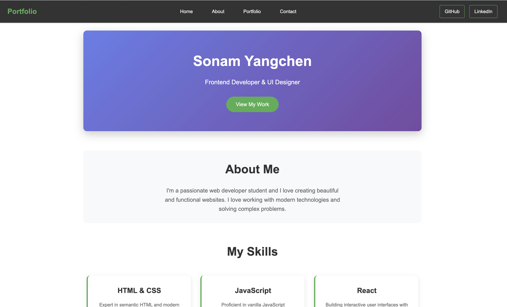

# Exercises

# Simple Landing Page

Create a simple landing page for a fictional e-commerce site that sells tech gadgets. The page should include a navigation bar, a grid-based product listing section, and a footer. 

1. Use semantic HTML elements like `<header>`, `<nav>`, `<main>`, `<section>`, and `<footer>` to structure your webpage.
2. Include a navigation bar with links to "Home", "Products", "About Us", and "Contact".
3. Create a product section using a grid layout to display at least 6 products with images, names, and prices.
4. Add a footer with links to privacy policy, terms of service, and social media icons.

5. Implement Responsive Design:
- Use media queries to create at least two breakpoints: tablet (768px to 1023px), and desktop (1024px and above)
- Use relative units (em, rem, %, vh, vw) for sizing elements where appropriate
- Implement a responsive hero section at the top of the page with a background image and overlay text

# Styling List

Create an HTML file with an ordered list of at least 5 college events. Each event should include the event name, time, and location as nested unordered list.

Style the list using CSS to make it stand out:
- Use custom bullets or numbers instead of default ones
- Add hover effects that change the color of the text or background when the user hovers over an event.
- Include spacing and padding to ensure the list is easy to read.

# Styling table

Create an HTML table to keep track of your grades throughout the semester. You should list all your modules, assignments, exams, and their respective scores. The table should include the following columns:
- Module
- Assignment/Exam Name
- Maximum Marks
- Marks Obtained
- Percentage
- Grade

Example: 
Module: "SDA101" - Assignment 1: "Figma Design" - Max Marks: 10 - Marks Obtained: 7 - Percentage: 70% - Grade: B

---
###
---
# Hostel Room Maintenance Request Form

Create an HTML form for hostel room maintenance requests and style it using CSS. Include information like name, room number, type of issue, description, urgency etc.

Some suggestions while styling the form:
- Style the form to have a clean, modern look.
- Incorporate appropriate input types and placeholders
- Use an appropriate color scheme that's easy on the eyes.
- Style form inputs consistently, including on focus states.
- Make the submit button stand out.

## **Sample Sections**

### **Full Name**
- **Input type**: `text`
- **Requirements**: Required, 2-50 characters, pattern validation for letters and spaces only
- **Placeholder**: "Enter your full name"

### **Student ID**
- **Input type**: `number` or `text` with pattern
- **Requirements**: Required, exactly 8 digits, numeric validation
- **Placeholder**: "02250123"

### **Email Address**
- **Input type**: `email`
- **Requirements**: Required, valid email format
- **Placeholder**: "student.cst@rub.edu.bt"

### **Phone Number**
- **Input type**: `tel`
- **Requirements**: Required, phone pattern validation
- **Placeholder**: "12345678"

---

## **Room Information Section**

### **Block/Building Name**
- **Input type**: `select` dropdown
- **Options**: Block A, Block B, Block C, Block F, RK
- **Requirements**: Required selection

### **Room Number**
- **Input type**: `number`
- **Requirements**: Required, range 100-999
- **Placeholder**: "Room number (e.g., 205)"

### **Floor Number**
- **Input type**: `number`
- **Requirements**: Required, range 1-10
- **Placeholder**: "Floor number"

---

## **Issue Details Section**

### **Type of Issue**
- **Input type**: `select` dropdown with grouped options
- **Categories**:
  - Electrical
  - Plumbing
  - Furniture
  - Infrastructure
  - Cleaning
  - Other


### **Issue Priority/Urgency**
- **Input type**: `radio` buttons
- **Options**:
  - Emergency (Immediate attention required)
  - High (Within 24 hours)
  - Medium (Within 3 days)
  - Low (Within a week)
- **Requirements**: Required selection

### **Issue Description**
- **Input type**: `textarea`
- **Requirements**: Required, 20-500 characters, word counter
- **Placeholder**: "Please describe the issue in detail..."
- **Attributes**: `rows="5" cols="50"`

---
###
---

# Portifolio webpage

## Using Flexbox for Components + Grid for Layout

### Exercise Overview
Create a single portfolio webpage that demonstrates both Flexbox and Grid by using:
- **Flexbox** for the navigation bar and card components
- **Grid** for the main page layout and image gallery

---
### 1. Create Your Files
Create two files in a folder:
- `index.html`
- `style.css`

### 2. HTML Structure
Type this HTML code into your `index.html`:

```html
<!DOCTYPE html>
<html lang="en">
<head>
    <meta charset="UTF-8">
    <meta name="viewport" content="width=device-width, initial-scale=1.0">
    <title>Portfolio</title>
    <link rel="stylesheet" href="style.css">
</head>
<body>
    <!-- Navigation Bar (Use FLEXBOX here) -->
    <nav class="navbar">
        <div class="logo">Portfolio</div>
        <ul class="nav-menu">
            <li><a href="#home">Home</a></li>
            <li><a href="#about">About</a></li>
            <li><a href="#portfolio">Portfolio</a></li>
            <li><a href="#contact">Contact</a></li>
        </ul>
        <div class="nav-social">
            <a href="#">GitHub</a>
            <a href="#">LinkedIn</a>
        </div>
    </nav>

    <!-- Main Content Container (Use GRID here) -->
    <div class="page-container">
        
        <!-- Hero Section -->
        <section class="hero" id="home">
            <h1>Sonam</h1>
            <p>Frontend Developer & UI Designer</p>
            <button class="cta-button">View My Work</button>
        </section>

        <!-- About Section -->
        <section class="about" id="about">
            <h2>About Me</h2>
            <p>I'm a passionate web developer student who loves creating beautiful and functional websites. I love working with modern technologies and solving complex problems.</p>
        </section>

        <!-- Skills Cards (Use FLEXBOX for the cards) -->
        <section class="skills">
            <h2>My Skills</h2>
            <div class="skills-container">
                <div class="skill-card">
                    <h3>HTML & CSS</h3>
                    <p>Expert in semantic HTML and modern CSS</p>
                </div>
                <div class="skill-card">
                    <h3>JavaScript</h3>
                    <p>Proficient in vanilla JavaScript</p>
                </div>
                <div class="skill-card">
                    <h3>React</h3>
                    <p>Building interactive user interfaces with React and hooks</p>
                </div>
            </div>
        </section>

        <!-- Portfolio Gallery (Use GRID here) -->
        <section class="portfolio" id="portfolio">
            <h2>My Work</h2>
            <div class="gallery">
                <div class="project project-1">
                    
                    <h3>E-commerce Site</h3>
                </div>
                <div class="project project-2">
                    
                    <h3>Weather App</h3>
                </div>
                <div class="project project-3">
                    
                    <h3>Portfolio Site</h3>
                </div>
                <div class="project project-4">
                    
                    <h3>Blog Platform</h3>
                </div>
                <div class="project project-5">
                    
                    <h3>Mobile App</h3>
                </div>
                <div class="project project-6">
                    
                    <h3>Dashboard</h3>
                </div>
            </div>
        </section>

    </div>
</body>
</html>
```

---

## Your Tasks

### Task 1: Setup Basic Styles
Add this starter CSS to your `style.css` file:

```css
* {
    margin: 0;
    padding: 0;
    box-sizing: border-box;
}

body {
    font-family: Arial, sans-serif;
    line-height: 1.6;
    color: #333;
}

/* You'll add your Flexbox and Grid styles below */
```

### Task 2: Navigation Bar with Flexbox 
**Use Flexbox to create the navigation bar layout:**

```css
.navbar {
    /* TODO: Make this a flex container */
    /* TODO: Space items across the navbar */
    /* TODO: Center items vertically */
    background: #333;
    color: white;
    padding: 1rem 2rem;
}

.nav-menu {
    /* TODO: Make this a flex container */
    /* TODO: Remove list styles */
    /* TODO: Add space between menu items */
}

.nav-social {
    /* TODO: Make this a flex container */
    /* TODO: Add space between social links */
}
```

**What you need to do:**
- Make `.navbar` a flex container
- Use `justify-content: space-between` to spread logo, menu, and social links
- Make `.nav-menu` and `.nav-social` flex containers
- Add gaps between navigation items
- Remove list bullets from the menu

### Task 3: Main Layout with Grid 
**Use Grid to create the main page layout:**

```css
.page-container {
    /* TODO: Make this a grid container */
    /* TODO: Define grid areas for each section */
    /* TODO: Set up appropriate row sizes */
    max-width: 1200px;
    margin: 0 auto;
    padding: 2rem;
}
```

**What you need to do:**
- Make `.page-container` a grid container
- Create grid areas for: hero, about, skills, portfolio, contact
- Use `grid-template-areas` to define the layout
- Make each section span the full width

### Task 4: Skills Cards with Flexbox 
**Use Flexbox for the skills cards:**

```css
.skills-container {
    /* TODO: Make this a flex container */
    /* TODO: Allow cards to wrap */
    /* TODO: Add space between cards */
}

.skill-card {
    /* TODO: Set flex properties for responsive sizing */
    /* TODO: Add styling for the cards */
    background: #f4f4f4;
    padding: 2rem;
    border-radius: 8px;
    text-align: center;
}
```

**What you need to do:**
- Make `.skills-container` a flex container that wraps
- Set each `.skill-card` to have a minimum width but grow to fill space
- Add gaps between cards
- Make cards equal height

### Task 5: Portfolio Gallery with Grid 
**Use Grid for the project gallery:**

```css
.gallery {
    /* TODO: Make this a grid container */
    /* TODO: Create responsive columns */
    /* TODO: Add gaps between projects */
}

.project {
    background: white;
    border-radius: 8px;
    box-shadow: 0 2px 5px rgba(0,0,0,0.1);
    padding: 1rem;
    text-align: center;
}

.project img {
    width: 100%;
    border-radius: 4px;
}
```

**What you need to do:**
- Make `.gallery` a grid container
- Use `repeat(auto-fit, minmax(280px, 1fr))` for responsive columns
- Add grid gaps
- Make sure images fit properly in their containers

### Task 6: Make it Responsive 
Add responsive behavior for mobile devices:

```css
@media (max-width: 768px) {
    .navbar {
        /* TODO: Stack navbar items vertically */
    }
    
    .skills-container {
        /* TODO: Make cards stack on mobile */
    }
    
    .gallery {
        /* TODO: Adjust grid columns for mobile */
    }
}
```

---

## Expected Results

### Desktop View:
- Navigation bar with logo on left, menu in center, social links on right
- Hero section spanning full width
- Skills cards in a row (3 across)
- Portfolio gallery in a responsive grid (2-3 columns)
- All sections properly spaced

### Mobile View:
- Navigation stacked vertically or hamburger menu
- Skills cards stacked in single column
- Portfolio projects in single column
- Everything remains readable and accessible

#### Example:


---